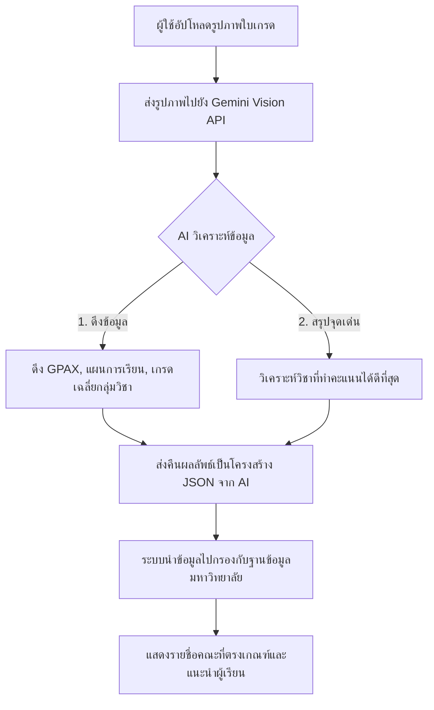

# แผนการดำเนินงานและแบบร่างระบบ (Implementation Plan)
## ระบบแนะนำมหาวิทยาลัยในประเทศไทยด้วย AI (Thai University Recommendation System)

เอกสารฉบับนี้เป็นแบบร่าง (Draft) เพื่อเสนอรายละเอียดการพัฒนาเว็บแอปพลิเคชันแนะนำมหาวิทยาลัย คณะ และสาขาวิชา โดยใช้ AI วิเคราะห์จากใบแสดงผลการเรียน (ใบเกรด/Transcript) ของผู้ใช้งาน เปรียบเทียบกับฐานข้อมูลมหาวิทยาลัย

---

## 1. ภาพรวมระบบ (System Architecture)

เพื่อความรวดเร็ว สวยงาม และง่ายต่อการทดสอบ/ใช้งาน เราจะเลือกใช้ Stack ดังนี้:
- **Frontend**: **Next.js (React)** ร่วมกับ **TailwindCSS** (ตามความต้องการการออกแบบที่ทันสมัย รวดเร็ว และ Responsive) หรือ **Vanilla CSS (Premium Glassmorphism)** เพื่อความพรีเมียม
- **Backend API**: **Next.js Route Handlers** (Serverless API ในตัว ไม่ต้องตั้งเซิร์ฟเวอร์แยก)
- **AI Processing**: **Gemini 2.5 Flash / Gemini 1.5 Flash (Vision API)** สำหรับการสแกนและวิเคราะห์ใบเกรดจากรูปภาพ/PDF
- **Database**: ฐานข้อมูลแบบ **JSON หรือ SQLite** บรรจุรายชื่อมหาวิทยาลัย คณะ สาขาวิชา เกณฑ์การรับเข้า (เช่น GPAX ขั้นต่ำ, แผนการเรียน) เพื่อให้ง่ายต่อการ Deploy และ Query

---

## 2. หน้าจอและการออกแบบ (UI/UX Design)

เราจะเน้นการออกแบบสไตล์ **Modern Premium (Edu-Tech Theme)** โทนสีน้ำเงินเข้มและทอง/ขาว สะอาดตา เข้าใจง่าย และมี Micro-animations

### หน้าหลักและขั้นตอนการทำงานของผู้ใช้งาน (User Flow)
1. **Home / Upload Page (หน้าแรกและอัปโหลด)**
   - ฮีโร่แบนเนอร์สวยงามแนะนำระบบ
   - ช่องสำหรับลากและวาง (Drag & Drop) หรืออัปโหลดรูปภาพใบเกรด (รองรับ `.jpg`, `.png`, `.pdf`)
   - ตัวเลือกเสริมสำหรับระบุ "ความสนใจพิเศษ" หรือ "คณะที่สนใจเป็นพิเศษ" เพื่อให้ AI แนะนำได้ตรงใจมากขึ้น
2. **AI Processing Screen (หน้าจอกำลังประมวลผล)**
   - แสดง Animation โหลดล้ำๆ เสมือน AI กำลังอ่านและวิเคราะห์ใบเกรด (เช่น แสงเลเซอร์สแกนใบเกรด)
3. **Results Page (หน้าแสดงผลลัพธ์)**
   - **ด้านซ้าย (สรุปข้อมูลผู้เรียนจาก AI)**: แสดงผลการเรียนที่ AI วิเคราะห์ได้ (GPAX, สายการเรียน เช่น วิทย์-คณิต/ศิลป์-คำนวณ, วิชาที่โดดเด่น)
   - **ด้านขวา (รายการมหาวิทยาลัยที่แนะนำ)**: รายการมหาวิทยาลัย คณะ และสาขาวิชาที่ตรงเกณฑ์ จัดหมวดหมู่ตามระดับความเป็นไปได้ (เช่น "ตรงเกณฑ์แนะนำ", "มีโอกาสสูง", "ท้าทายแต่ลองได้")
4. **Detail View (หน้าต่างข้อมูลรายละเอียด)**
   - เมื่อคลิกที่คณะ/สาขา จะเปิด **Modal/Drawer** แสดงข้อมูลเชิงลึก เช่น ค่าเทอม, เกณฑ์การรับสมัครรอบต่างๆ, อาชีพหลังจบการศึกษา และลิงก์ไปยังเว็บหลักของคณะนั้นๆ

---

## 3. ฐานข้อมูลมหาวิทยาลัย (Mock Database Schema)

เราจะออกแบบฐานข้อมูลเบื้องต้นสำหรับใช้เปรียบเทียบข้อมูล เช่น:

```json
[
  {
    "id": "chula-eng-computer",
    "university": "จุฬาลงกรณ์มหาวิทยาลัย",
    "faculty": "คณะวิศวกรรมศาสตร์",
    "department": "สาขาวิชาวิศวกรรมคอมพิวเตอร์",
    "gpax_minimum": 3.00,
    "study_track": ["วิทย์-คณิต", "ศิลป์-คำนวณ"],
    "required_subjects": ["คณิตศาสตร์", "ฟิสิกส์"],
    "details": {
      "tuition_fee": "21,000 บาท/ภาคการศึกษา",
      "rounds": "รอบที่ 1 Portfolio, รอบที่ 2 Quota, รอบที่ 3 Admission",
      "careers": "วิศวกรซอฟต์แวร์, นักวิเคราะห์ระบบ, นักพัฒนาเว็บ, AI Developer",
      "link": "https://www.eng.chula.ac.th"
    }
  },
  {
    "id": "kmutt-sit-it",
    "university": "มหาวิทยาลัยเทคโนโลยีพระจอมเกล้าธนบุรี (KMUTT)",
    "faculty": "คณะเทคโนโลยีสารสนเทศ",
    "department": "สาขาวิชาเทคโนโลยีสารสนเทศ (IT)",
    "gpax_minimum": 2.50,
    "study_track": ["วิทย์-คณิต", "ศิลป์-คำนวณ", "ทุกแผนการเรียน"],
    "required_subjects": ["คณิตศาสตร์", "ภาษาอังกฤษ"],
    "details": {
      "tuition_fee": "32,000 บาท/ภาคการศึกษา",
      "rounds": "รอบที่ 1 Portfolio (Active Recruitment), รอบที่ 3 Admission",
      "careers": "System Administrator, DevOps Engineer, IT Consultant, Web Developer",
      "link": "https://www.sit.kmutt.ac.th"
    }
  }
]
```

---

## 4. ขั้นตอนการทำงานของ AI (AI Processing Logic)



### Prompt สำหรับ AI (Gemini) ในการอ่านใบเกรด
AI จะทำหน้าที่สแกนใบเกรด (OCR + Extraction) และแปลงเป็นข้อมูลสรุป เช่น:
- **เกรดเฉลี่ยสะสม (GPAX)**
- **แผนการเรียน (เช่น วิทย์-คณิต, ศิลป์-ภาษา)**
- **จุดเด่น/จุดด้อยด้านวิชาการ** (เช่น ถนัดคณิตศาสตร์และวิทยาศาสตร์ แต่อาจต้องพัฒนาภาษาอังกฤษ)

---

## 5. แผนการสร้างและเทคโนโลยีย่อย

1. **เฟส 1: สร้างฐานข้อมูลและโครงสร้างโครงการ**
   - พัฒนาด้วย Next.js (TypeScript) + TailwindCSS
   - ตั้งค่า UI Theme (Dark Mode / Premium Modern)
   - จัดทำฐานข้อมูลตัวอย่างคณะและมหาวิทยาลัยยอดนิยมในไทย (ประมาณ 10-15 หลักสูตรหลักเพื่อทดสอบระบบ)
2. **เฟส 2: การพัฒนาส่วนติดต่อผู้ใช้ (Frontend & Design)**
   - พัฒนาหน้าแรก (Landing & Upload)
   - ทำหน้า Loading animation สวยงาม
   - ทำหน้าแสดงรายการผลลัพธ์ และ Modal รายละเอียดคณะ
3. **เฟส 3: เชื่อมต่อ AI (Backend API & Gemini Integration)**
   - พัฒนา API Endpoint ในการรับไฟล์ภาพ
   - เขียนฟังก์ชันวิเคราะห์ภาพใบเกรดด้วย Gemini API (ให้ AI ดึงข้อมูลเกรดและสายการเรียนออกมา)
   - นำผลลัพธ์จาก AI มาจับคู่กับฐานข้อมูลที่มีอยู่
4. **เฟส 4: ทดสอบระบบและปรับแต่งความลื่นไหล**
   - ทดลองอัปโหลดใบเกรดจำลองเพื่อดูความถูกต้องของการแนะนำ
   - ปรับปรุงการออกแบบ (Animations & Hover Effects)

---

### กรุณาตรวจสอบแบบร่างนี้
หากคุณเห็นชอบกับแผนการและโครงสร้างนี้แล้ว โปรดแจ้งให้เราทราบ:
1. **ต้องการปรับเปลี่ยนฐานข้อมูล หรือมีคณะ/มหาวิทยาลัยใดเป็นพิเศษที่อยากให้ใส่ลงไปหรือไม่?**
2. **ต้องการให้ใช้ดีไซน์สไตล์ใด (เช่น สว่างสะอาดตา หรือ มืดล้ำยุค Glassmorphism)?**
3. **หากกดยืนยัน เราจะเริ่มติดตั้ง Project และพัฒนาโครงสร้างให้ทันทีครับ!**
